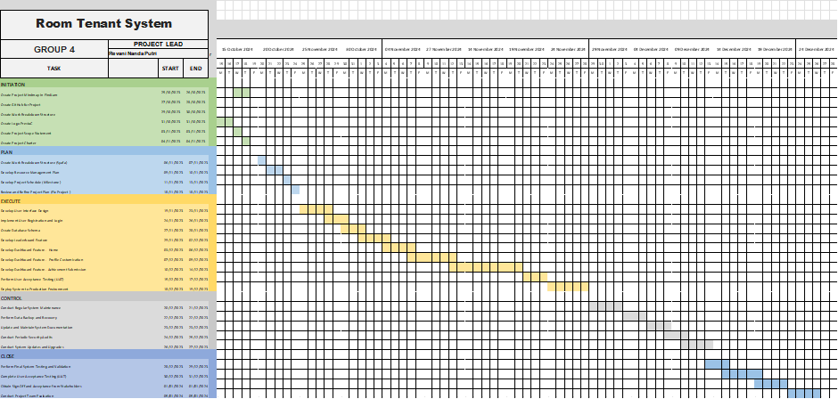

# Project Charter

## Judul Proyek
Sistem Pencatatan Prestasi Mahasiswa

## Project Purpose
Tujuan dari web ini adalah untuk memberikan transparansi informasi atas capaian prestasi antar mahasiswa serta memberikan kemudahan mahasiswa untuk mencari informasi terkait kompetisi skala kecil maupun besar. Aplikasi ini digunakan oleh dosen dan admin di JTI untuk mempermudah dalam mengorganisir hasil prestasi mahasiswa. Selain itu, aplikasi ini juga dapat mempermudah admin untuk menentukan mahasiswa berprestasi di jurusan teknologi informasi.

## Project Scope
### In Scope
- Web dapat diakses oleh admin,dosen, dan juga mahasiswa menggunakan browser web 
- Web memiliki fitur autentikasi seperti memasukkan username dan password untuk memastikan hanya pengguna yang memiliki kewenangan yang dapat mengakses web
- Web harus memiliki panduan atau tata cara untuk menjalankan sebuah web khususnya untuk pengguna dengan pengalaman pertama
- Dosen, admin, dan juga mahasiswa harus dapat melihat prestasi non-akademik yang dimiliki oleh mahasiswa
- Akses nilai akademik atau IPK hanya bisa diakses oleh admin, dosen yang terkait dengan mata kuliah tersebut, dan juga mahasiswa yang memiliki nilai IPK itu sendiri

### Out of Scope
- erintegrasi dengan sistem lain yang diluar lingkup jurusan teknologi informasi politeknik negeri malang
- Akses prestasi mahasiswa yang bukan dari jurusan teknologi informasi politeknik negeri malang

## Stakeholders
- Project Sponsor :Jurusan Teknologi Informasi Politeknik Negeri Malang
- Project Manager : Revani Nanda Putri
-  Project Team : Alvi Choirinnikmah, Ardhelia Putri Maharani, Ramadhan Maulana, Revani Nanda Putri, Susilowati Syafa Adilah
- Project Users : Dosen, mahasiswa, admin jurusan teknologi informasi politeknik negeri malang

## Project Deliverables 
- Web Application
- Database Application
- Final Report of Project

## Project Milestone and Timeline

(Gambar Milestone Timeline Sistem PrestaC)

## Project Risks 
- Technical Challenge : Anggota tim tidak menyelesaikan tugas sesuai dengan tenggat waktu yang telah ditentukan. Selain itu, anggota tim tidak berpartisipasi dalam proses pengerjaan.
- User Adoption : User kesulitan untuk mengoperasikan web secara baik, dan tidak minat untuk mengoperasikannya
- Data Loss : Tidak adanya back up data pada sistem web sehingga menimbulkan permasalahan yang serius apabila terjadi penumpukan data yang berlebih dan juga terdapat virus
- Security : Aplikasi tidak aman dan dapat diretas oleh oknum untuk mencuri data yang menyebabkan kerusakan pada sistem

## Project Success Criteria
- Sistem web dapat memenuhi semua kebutuhan sesuai dengan project scope
- Sistem web memiliki keamanan yang cukup 
- Sistem web dapat dioperasikan secara mudah dan dapat dipahami oleh berbagai kalangan
- Sistem web terdokumentasi dengan baik
- Sistem web telah teruji dengan baik

